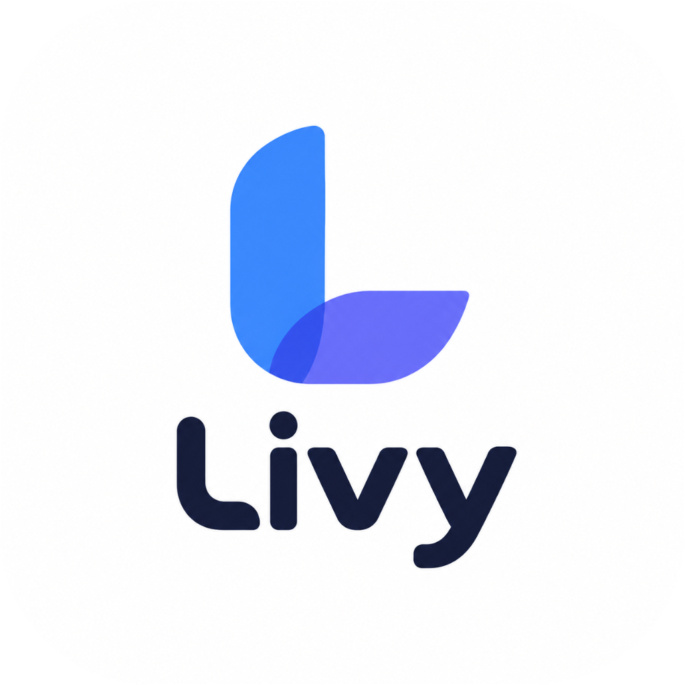
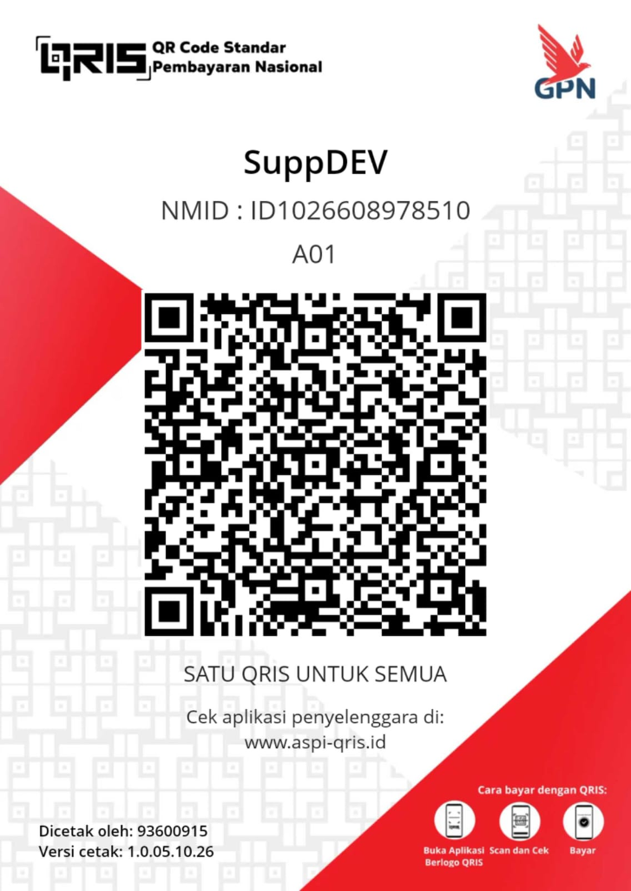

<div align="center">

  

  # Livy

  **Bring Your Desktop to Life.**  
  *A modern, lightweight, and elegant Live Wallpaper engine for Windows.*

  [-0078D6?style=flat&logo=windows)](https://github.com/VemD04/Livy)
  [](https://dotnet.microsoft.com/)
  [](https://code.videolan.org/videolan/LibVLCSharp)
  [](https://github.com/VemD04/Livy)
  [](LICENSE)

</div>

---

## 📖 Overview

**Livy** adalah aplikasi live wallpaper modern dan efisien untuk Windows yang dirancang untuk mempercantik desktop Anda tanpa mengorbankan performa komputer ataupun daya baterai. 

Menggunakan integrasi tingkat rendah **Win32 Shell API (WorkerW injection)**, wallpaper video dirender tepat di belakang ikon desktop dan taskbar Anda dengan akselerasi penuh **Direct3D 11 GPU** melalui **LibVLCSharp**.

---

## ✨ Fitur Utama (Key Features)

### 🖥️ Integrasi Desktop Halus (WorkerW Shell Hook)
- Merender wallpaper video tepat di belakang ikon desktop Windows tanpa mengganggu fungsi shortcut atau interaksi desktop.
- Kompatibel dengan Windows 10 & Windows 11 (arsitektur 64-bit).

### ⚡ Akselerasi Hardware & Hemat Daya (Performance & Battery Conscious)
- **Direct3D 11 GPU Acceleration**: Pemutaran video 60 FPS yang halus dengan penggunaan CPU & RAM yang sangat minim.
- **Smart Game & Fullscreen Auto-Pause**: Livy mendeteksi ketika aplikasi layar penuh atau game sedang aktif dan otomatis menahan pemutaran video untuk membebaskan 100% resource GPU/CPU.
- **Battery Saver Auto-Pause**: Otomatis menghentikan live wallpaper saat laptop berjalan dengan tenaga baterai.
- **Performance Profiles**: Pilihan mode *Balanced*, *Low Power*, dan *Maximum Quality*.

### 🔄 Optimasi Seamless Loop
Ucapkan selamat tinggal pada video wallpaper yang patah atau melompat (*stutter*) saat video selesai diputar:
- **Forward-Reverse (Ping-Pong / Boomerang)**: Memutar video maju lalu mundur secara mulus tanpa potongan kasar.
- **Smooth Crossfade**: Melakukan transisi dissolve halus dari akhir video kembali ke awal.
- **Standard Loop**: Pengulangan standar dari awal hingga akhir.

### 🖼️ Manajemen Galeri Wallpaper yang Lengkap (CRUD)
- **Drag & Drop Import**: Cukup seret dan letakkan file video ke dalam aplikasi.
- **Thumbnail Otomatis**: Generator thumbnail instan dan ekstraksi metadata (Resolusi, FPS, Durasi).
- **Fullscreen Preview**: Pratinjau wallpaper dalam mode layar penuh sebelum diterapkan.
- **Format Video yang Didukung**: `.mp4`, `.webm`, `.mkv`, `.avi`, `.mov`.

### 🖥️ Dukungan Multi-Monitor & Penskalaan (Multi-Display & Scaling)
- Pilihan tampilan: **Primary Monitor Only** atau **All Connected Displays**.
- Mode penskalaan fleksibel: **Fill** (Crop to fit), **Fit** (Proporsional), **Stretch**, dan **Center**.

### 🎨 Desain Modern & Pengalaman Pengguna (Modern UI/UX)
- Tampilan modern bergaya Fluent / Glassmorphism khas Windows 11.
- Dukungan **Dark Mode** dan **Light Mode**.
- Dukungan multi-bahasa: **Bahasa Indonesia** & **English**.
- **System Tray Integration**: Akses cepat untuk Pause, Resume, Ganti Wallpaper, atau Pengaturan langsung dari area notifikasi taskbar.
- Pengaturan audio dan volume suara wallpaper yang dapat disesuaikan.
- Opsi **Start with Windows** dan **Start Minimized**.

---

## 🛠️ Teknologi yang Digunakan (Tech Stack)

| Komponen | Teknologi |
| :--- | :--- |
| **Framework** | C# / [.NET 10](https://dotnet.microsoft.com/) (Windows Presentation Foundation - WPF) |
| **Video Playback Engine** | [LibVLCSharp](https://github.com/videolan/libvlcsharp) (VideoLAN LibVLC 3.x) |
| **Hardware Acceleration** | Direct3D 11 |
| **Video Processing / Seamless** | FFmpeg |
| **Desktop Hook** | Windows Win32 Shell API (`user32.dll` / WorkerW) |
| **System Tray** | Hardcodet.NotifyIcon.Wpf |
| **Packaging** | Inno Setup (Modern Windows 11 Installer) |

---

## 📋 Kebutuhan Sistem (System Requirements)

- **Sistem Operasi**: Windows 10 (64-bit) atau Windows 11 (64-bit)
- **Runtime**: [.NET 10 Desktop Runtime](https://dotnet.microsoft.com/download/dotnet/10.0) (x64)
- **GPU**: Kartu grafis yang mendukung DirectX 11 / Direct3D 11
- *(Opsional)* **FFmpeg** terinstal di sistem PATH untuk fitur optimasi transisi video *Crossfade* & ekstraksi thumbnail video cepat.

---

## 🚀 Memulai (Getting Started)

### Cara 1: Menggunakan Installer
1. Unduh installer `Livy-Setup.exe` dari tab [Releases](https://github.com/VemD04/Livy/releases).
2. Jalankan installer dan ikuti petunjuk wizard di layar.
3. Buka **Livy** dari Start Menu atau Desktop shortcut.

### Cara 2: Build dari Source Code

Pastikan Anda telah menginstal [.NET 10 SDK](https://dotnet.microsoft.com/download/dotnet/10.0) dan Visual Studio 2022 / VS Code.

```bash
# Clone repository
git clone https://github.com/VemD04/Livy.git
cd Livy/src

# Restore dependensi
dotnet restore

# Jalankan dalam mode Debug
dotnet run

# Atau buat binary publish mandiri (Release)
dotnet publish -c Release -r win-x64 --self-contained false
```

---

## 📖 Panduan Penggunaan (Usage Guide)

1. **Menambahkan Wallpaper**:
   - Klik tombol **+ Add Wallpaper** di halaman Library, lalu pilih atau seret file video (`.mp4`, `.webm`, `.mkv`, dll).
2. **Menerapkan Wallpaper**:
   - Arahkan kursor ke kartu wallpaper dan klik **Apply** atau klik **Preview** untuk melihatnya terlebih dahulu.
3. **Mengatur Mode Loop**:
   - Klik kanan pada kartu wallpaper dan pilih **Edit** untuk memilih mode putar: *Standard*, *Ping-Pong*, atau *Crossfade*.
4. **Pengaturan Performa**:
   - Buka menu **Settings** untuk mengaktifkan jeda otomatis saat aplikasi fullscreen atau saat menggunakan baterai laptop.

---

## 🤝 Kontribusi (Contributing)

Kontribusi selalu diterima dengan senang hati! Jika Anda menemukan bug atau memiliki ide fitur baru:
1. Fork repository ini.
2. Buat branch fitur baru (`git checkout -b feature/NamaFitur`).
3. Commit perubahan Anda (`git commit -m "Add: fitur baru"`).
4. Push ke branch Anda (`git push origin feature/NamaFitur`).
5. Buat **Pull Request**.

---

## ☕ Dukung Pengembang (Support Developer)

Jika Anda menyukai aplikasi **Livy** dan ingin mendukung pengembangannya agar terus aktif dan bebas iklan:

<div align="center">
  
  <p><b>Scan QRIS via GoPay, OVO, DANA, BCA, atau Mobile Banking Anda.</b><br>
  <i>Terima kasih banyak atas apresiasi dan dukungan Anda! ❤️</i></p>
</div>

---

## 👤 Author

- **VemD04** - [GitHub](https://github.com/VemD04)

---

## 📄 Lisensi

Proyek ini dilisensikan di bawah lisensi [MIT](LICENSE) - silakan gunakan dan kembangkan secara bebas sesuai ketentuan lisensi.

